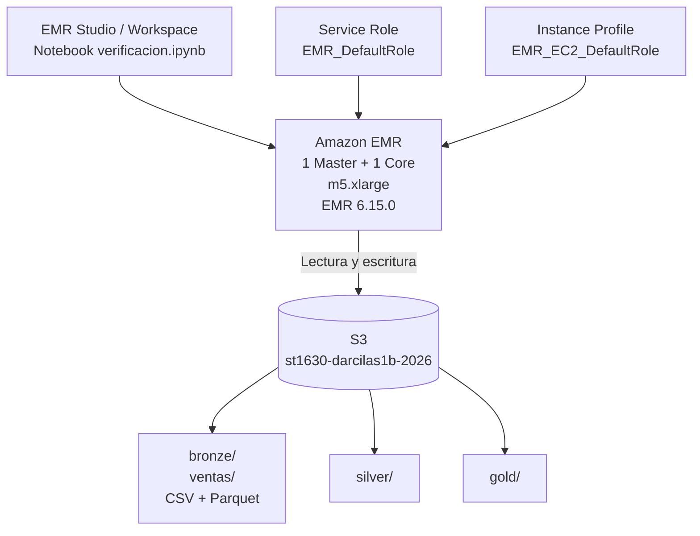
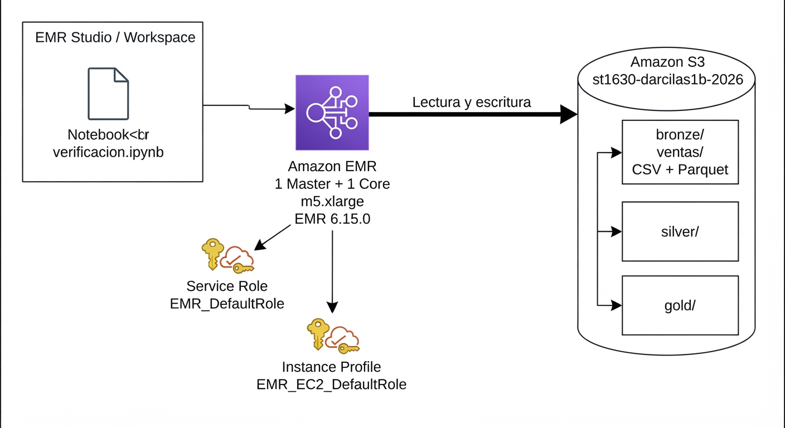

# Arquitectura — Lab 1a

**Curso:** ST1630-2026-2 · **Semana:** S4-S5 · **Fecha de entrega:** 13 de agosto de 2026  
**Estudiante:** Daniel Arcila Salazar · darcilas1@eafit.edu.co

## 1. Diagrama de la arquitectura

> **Nota del entorno:** el Sandbox de AWS Academy no permitió crear un rol IAM personalizado (`iam:CreateRole` devolvió `AccessDenied`). Por eso se reutilizaron los roles preaprovisionados `EMR_DefaultRole` y `EMR_EC2_DefaultRole`.

## 2. Decisiones de S3

| Decisión | Tu elección | Justificación |
|---|---|---|
| Nombre del bucket | `st1630-darcilas1b-2026` | Se usó un nombre único que identifica el curso, estudiante y año. El sufijo `b` fue necesario porque al reiniciar el Sandbox cambió la cuenta AWS y el bucket anterior seguía ocupado globalmente. |
| Región | `us-east-1` | Es la región usada por el Sandbox y por todos los recursos del laboratorio. |
| Estructura de prefijos | `bronze/`, `silver/`, `gold/` | Permite separar datos crudos, datos transformados y datos listos para consumo. Los archivos de prueba quedaron en `bronze/ventas/`. |

**Justificación del particionamiento:**  
Se utilizó Bronze/Silver/Gold porque permite separar claramente cada etapa del procesamiento de datos. Para este laboratorio, con solo 10.000 registros, no fue necesario agregar particiones por fecha o región. En un escenario de producción con mayor volumen sí consideraría particionar por fecha y, dependiendo de las consultas, por región.

## 3. Decisiones de IAM

- **¿Qué permisos otorgaste al rol de EMR, exactamente?**

  El diseño inicial proponía un rol personalizado con `s3:GetObject`, `s3:PutObject` y `s3:DeleteObject` sobre los objetos de mi bucket, además de `s3:ListBucket` sobre el bucket. Sin embargo, el Sandbox bloqueó `iam:CreateRole`, por lo que no fue posible aplicar ese rol. Se reutilizó `EMR_EC2_DefaultRole`, cuyo acceso a S3 fue verificado con `simulate-principal-policy`, obteniendo `allowed` para `GetObject` y `PutObject` sobre mi bucket.

- **¿Qué permisos consideraste y descartaste? ¿Por qué?**

  Se descartó usar una política con `s3:*` y `Resource: "*"`, porque otorgaría permisos excesivos sobre recursos que el clúster no necesita. La intención fue mantener el acceso limitado únicamente a las operaciones necesarias sobre el datalake.

- **¿Por qué importa el mínimo privilegio específicamente en un sistema distribuido como este?**

  En un sistema distribuido un rol excesivamente privilegiado puede afectar múltiples nodos y recursos al mismo tiempo. Limitar los permisos reduce el impacto de errores o credenciales comprometidas y ayuda a conservar las garantías que el resto del sistema espera, de forma análoga a evitar que un nodo entregue información inconsistente.

## 4. Decisiones de EMR

- **Tipo de instancia elegido y justificación:**

  Se utilizaron **2 instancias `m5.xlarge`**, una como nodo master y otra como core. Es una configuración mínima viable para ejecutar Spark de forma distribuida en el laboratorio. En producción usaría más nodos, auto scaling, instancias Spot cuando sea apropiado y dimensionamiento basado en el volumen real de datos.

- **Configuración de Spark/aplicaciones instaladas:**

  - Amazon EMR `6.15.0`
  - Spark
  - Hadoop
  - Livy
  - JupyterEnterpriseGateway
  - 1 nodo master + 1 nodo core
  - Bootstrap con `pandas` y `pyarrow`
  - EMR Studio conectado al clúster mediante un Workspace
  - Subnet utilizada: `subnet-092e1184285c91c22`
  - Región: `us-east-1`

  Inicialmente el clúster solo tenía Spark y Hadoop, pero EMR Studio indicó que faltaba `JupyterEnterpriseGateway`. Se recreó el clúster incluyendo Livy y JupyterEnterpriseGateway y posteriormente el Workspace pudo adjuntarse correctamente.

## 5. Estimación de costo

Para una estimación aproximada se toma un costo total cercano a **USD 0.48 por hora** para el clúster de dos `m5.xlarge` en `us-east-1`, sumando cómputo EC2 y el cargo de EMR. El almacenamiento EBS y S3 puede añadir un valor pequeño adicional.

| Escenario | Costo estimado |
|---|---|
| Clúster encendido 24/7 durante un mes | Aproximadamente **USD 350.40/mes** (`0.48 × 730 h`), más EBS y S3 |
| Clúster encendido solo durante ~3 horas para el lab | Aproximadamente **USD 1.44** (`0.48 × 3 h`), más EBS y S3 |

> La estimación es aproximada y debe contrastarse con AWS Pricing Calculator para la región y configuración exactas.

## 6. Reflexión — la era agéntica

La mayor duda estuvo en adaptar el laboratorio al Sandbox, especialmente por las restricciones de IAM y EMR Studio. Consulté a ChatGPT para diagnosticar errores de AWS CLI, roles, conexión del Workspace y requisitos del clúster. Las decisiones finales se tomaron verificando cada cambio directamente en AWS y comprobando los resultados con la CLI, Spark y Spark UI.

## 7. Bitácora de delegación

| Tarea | ¿Delegado a agente? | Justificación |
|---|---|---|
| Configuración inicial y troubleshooting de AWS CLI | Sí | Se usó Codex para identificar errores de configuración, credenciales temporales y diferencias entre PowerShell, WSL y Git Bash. |
| Configuración del datalake S3 | Parcial | El script ya venía en el repositorio; se recibió apoyo para adaptarlo al Sandbox y solucionar problemas de ejecución en Windows. |
| Diseño de la estructura Bronze/Silver/Gold | No | La estructura venía definida por el laboratorio y se mantuvo según los objetivos del ejercicio. |
| Configuración IAM | Parcial | Se analizó con Codex el error `AccessDenied` y se verificaron los roles disponibles, pero la elección se basó en las restricciones reales del Sandbox. |
| Creación y troubleshooting de EMR | Sí | Se utilizó Codex para adaptar `create_emr.sh`, reutilizar los roles existentes y agregar Livy/JupyterEnterpriseGateway. |
| Ejecución y lectura de S3 desde Spark | Parcial | El notebook ya contenía el código base; se configuró el bucket y se ejecutó directamente sobre el clúster. |
| Interpretación del benchmark | Parcial | Se recibió apoyo para interpretar los tiempos, pero los valores y conclusiones se basaron en la ejecución real del laboratorio. |
| Captura y análisis del DAG en Spark UI | Sí | Se usó Codex para localizar la consulta Parquet y verificar que el DAG incluyera un nodo `Exchange`. |

## Evidencia principal de la ejecución

- Bucket: `st1630-darcilas1b-2026`
- Dataset: **10.000 filas**
- Parquet: **185.5 KiB**
- CSV: **798.3 KiB**
- Coincidencias usadas en el benchmark (`Cali` + `Ropa`): **293**
- Resultado del benchmark:
  - Parquet: **1.474 s**
  - CSV: **0.923 s**
  - Ratio CSV / Parquet: **0.63x**
- El DAG de Spark mostró lectura `Scan parquet` y al menos un nodo **Exchange**.
 para diagnosticar errores de AWS CLI, roles, conexión del Workspace y requisitos del clúster. Las decisiones finales se tomaron verificando cada cambio directamente en AWS y comprobando los resultados con la CLI, Spark y Spark UI.

## 7. Bitácora de delegación

| Tarea | ¿Delegado a agente? | Justificación |
|---|---|---|
| Configuración inicial y troubleshooting de AWS CLI | Sí | Se usó Codex para identificar errores de configuración, credenciales temporales y diferencias entre PowerShell, WSL y Git Bash. |
| Configuración del datalake S3 | Parcial | El script ya venía en el repositorio; se recibió apoyo para adaptarlo al Sandbox y solucionar problemas de ejecución en Windows. |
| Diseño de la estructura Bronze/Silver/Gold | No | La estructura venía definida por el laboratorio y se mantuvo según los objetivos del ejercicio. |
| Configuración IAM | Parcial | Se analizó con Codex el error `AccessDenied` y se verificaron los roles disponibles, pero la elección se basó en las restricciones reales del Sandbox. |
| Creación y troubleshooting de EMR | Sí | Se utilizó Codex para adaptar `create_emr.sh`, reutilizar los roles existentes y agregar Livy/JupyterEnterpriseGateway. |
| Ejecución y lectura de S3 desde Spark | Parcial | El notebook ya contenía el código base; se configuró el bucket y se ejecutó directamente sobre el clúster. |
| Interpretación del benchmark | Parcial | Se recibió apoyo para interpretar los tiempos, pero los valores y conclusiones se basaron en la ejecución real del laboratorio. |
| Captura y análisis del DAG en Spark UI | Sí | Se usó Codex para localizar la consulta Parquet y verificar que el DAG incluyera un nodo `Exchange`. |

## Evidencia principal de la ejecución

- Bucket: `st1630-darcilas1b-2026`
- Dataset: **10.000 filas**
- Parquet: **185.5 KiB**
- CSV: **798.3 KiB**
- Coincidencias usadas en el benchmark (`Cali` + `Ropa`): **293**
- Resultado del benchmark:
  - Parquet: **1.474 s**
  - CSV: **0.923 s**
  - Ratio CSV / Parquet: **0.63x**
- El DAG de Spark mostró lectura `Scan parquet` y al menos un nodo **Exchange**.
