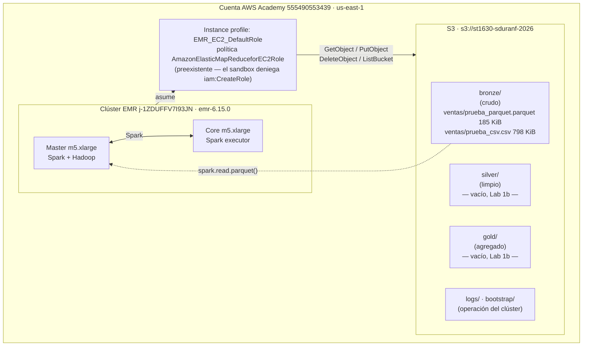

# Arquitectura — Lab 1a

**Curso:** ST1630-2026-2 · **Semana:** S4-S5 · **Fecha de entrega:** 2026-08-13
**Estudiante:** _(tu nombre completo)_ — sduranf@eafit.edu.co

> Los datos de esta plantilla corresponden a la ejecución real del 2026-08-13
> en la cuenta AWS Academy `555490553439`. Los campos marcados
> **`→ [ESCRIBE TÚ]`** son los que la política de IA del curso
> (`../../../docs/politica-ia.md`) exige que reflejen tu propio criterio.

## 1. Diagrama de la arquitectura



## 2. Decisiones de S3

| Decisión | Tu elección | Justificación |
|---|---|---|
| Nombre del bucket | `st1630-sduranf-2026` | → [ESCRIBE TÚ] |
| Región | `us-east-1` (Norte de Virginia) | → [ESCRIBE TÚ] |
| Estructura de prefijos | `bronze/`, `silver/`, `gold/` + `bronze/ventas/`; además `logs/` y `bootstrap/` para operación del clúster | → [ESCRIBE TÚ] |

**Justificación del particionamiento** (3-5 líneas): ¿por qué esa
estructura de prefijos y no otra? ¿Consideraste particionar además por
fecha o región dentro de cada capa?

> → [ESCRIBE TÚ]
>
> _Datos de tu ejecución que puedes usar como base: el dataset tiene 10.000
> filas con columnas `fecha` (rango 2025-08-01 a 2026-07-31) y `region`
> (Bogotá 3.955, Medellín 2.010, Cali 1.528, Otro 1.508, Barranquilla 999).
> La decisión de particionar o no por esas columnas es tuya._

## 3. Decisiones de IAM

> **Restricción del entorno (hecho verificado, no es una justificación):**
> el rol `voclabs` del Sandbox de AWS Academy deniega la creación de
> identidades IAM, por lo que `scripts/setup_iam.sh` no se pudo ejecutar:
>
> ```
> iam:CreateRole        → AccessDenied (al ejecutar el script)
> iam:CreatePolicy      → implicitDeny (simulate-principal-policy)
> iam:AttachRolePolicy  → implicitDeny (simulate-principal-policy)
> iam:PutRolePolicy     → implicitDeny (simulate-principal-policy)
> iam:PassRole          → allowed, solo sobre EMR_EC2_DefaultRole,
>                         EMR_DefaultRole y LabRole
> ```
>
> Por indicación del profesor se usó el rol preexistente
> **`EMR_EC2_DefaultRole`**, cuya política gestionada es
> `AmazonElasticMapReduceforEC2Role`. El service role del clúster es
> `EMR_DefaultRole` (`AmazonElasticMapReduceRole`).

- ¿Qué permisos otorgaste al rol de EMR, exactamente?

  → [ESCRIBE TÚ] — describe qué concede realmente
  `AmazonElasticMapReduceforEC2Role` frente a lo que EMR necesitaba para
  este lab (leer `bronze/ventas/`, escribir `logs/`).

- ¿Qué permisos consideraste y descartaste? ¿Por qué?

  → [ESCRIBE TÚ] — la política de mínimo privilegio que el lab pedía
  diseñar es la de `setup_iam.sh`: `GetObject`/`PutObject`/`DeleteObject`
  sobre `arn:aws:s3:::st1630-sduranf-2026/*` y `ListBucket` sobre el
  bucket. Contrasta ese diseño con lo que el entorno te impuso.

- ¿Por qué importa el mínimo privilegio específicamente en un sistema
  **distribuido** como este (no solo "es buena práctica")? Conecta con
  el Teorema CAP: un agente/rol con acceso excesivo es, en cierto
  sentido, un riesgo análogo al de un nodo que retorna datos
  inconsistentes — ambos rompen una garantía que el resto del sistema
  asume que se sostiene.

  → [ESCRIBE TÚ]

## 4. Decisiones de EMR

- Tipo de instancia elegido y justificación (¿por qué es "mínimo
  viable" para este ejercicio, y qué cambiarías para producción?):

  **Configuración ejecutada:** clúster `j-1ZDUFFV7I93JN`, release
  `emr-6.15.0`, 1 nodo master + 1 nodo core, ambos `m5.xlarge`
  (4 vCPU / 16 GiB c/u), subnet `subnet-004ae8d394125e85e` en la AZ
  `us-east-1a`, key pair `vockey`.

  → [ESCRIBE TÚ] la justificación.

- Configuración de Spark/aplicaciones instaladas:

  **Ejecutado:** aplicaciones `Spark` y `Hadoop`; bootstrap action que
  instala `pandas` y `pyarrow` en todos los nodos; logs del clúster en
  `s3://st1630-sduranf-2026/logs/`.

  → [ESCRIBE TÚ] si añadirías o quitarías algo.

## 5. Estimación de costo

> Insumos para tu cálculo (**verifica las tarifas vigentes en**
> [calculator.aws](https://calculator.aws/), que es lo que pide el lab):
> `m5.xlarge` on-demand en `us-east-1` ronda los USD 0,192/hora por
> instancia, más el recargo de EMR (~USD 0,048/hora por instancia), sobre
> 2 instancias. Añade el EBS de los nodos y el almacenamiento S3
> (~1 MB, despreciable).

| Escenario | Costo estimado |
|---|---|
| Clúster encendido 24/7 durante un mes | → [ESCRIBE TÚ] |
| Clúster encendido solo durante las ~3 horas que lo usaste para el lab | → [ESCRIBE TÚ] |

## 6. Reflexión — la era agéntica

¿En qué decisión de este lab dudaste más? ¿Qué le consultaste a un
agente de IA y qué terminaste decidiendo por tu cuenta?

> → [ESCRIBE TÚ]

## 7. Bitácora de delegación

> Las dos primeras columnas reflejan lo que **realmente** ocurrió en la
> sesión del 2026-08-13 con Claude Code (Opus 5). La justificación de
> cada fila la escribes tú.

| Tarea | ¿Delegado a agente? | Justificación |
|---|---|---|
| Instalación de AWS CLI v2 y setup del entorno local | Sí — Claude Code | → [ESCRIBE TÚ] |
| Edición de variables (`ESTUDIANTE`, `KEY_NAME`, `SUBNET_ID`) en los scripts | Sí — Claude Code | → [ESCRIBE TÚ] |
| Ejecución de `setup_s3.sh` y `create_emr.sh` | Sí — Claude Code | → [ESCRIBE TÚ] |
| Troubleshooting: rutas MSYS en `file://`, choque `--use-default-roles` vs `InstanceProfile`, apertura del puerto 22 | Sí — Claude Code | → [ESCRIBE TÚ] |
| Diagnóstico de los permisos IAM del sandbox (`simulate-principal-policy`) | Sí — Claude Code | → [ESCRIBE TÚ] |
| Decisión de qué permisos IAM otorgar | No — indicación del profesor (usar el rol preexistente) | → [ESCRIBE TÚ] |
| Diseño de la estructura de prefijos Bronze/Silver/Gold | No | → [ESCRIBE TÚ] |
| Justificaciones de este documento (§2 a §6) | No | → [ESCRIBE TÚ] |
| Interpretación del benchmark Spark y del DAG | No | → [ESCRIBE TÚ] |

> Recuerda: los permisos IAM, la estructura de prefijos, las
> justificaciones de este documento y la interpretación de los
> resultados de Spark deben reflejar tu propio criterio (ver
> `../../../docs/politica-ia.md`).
