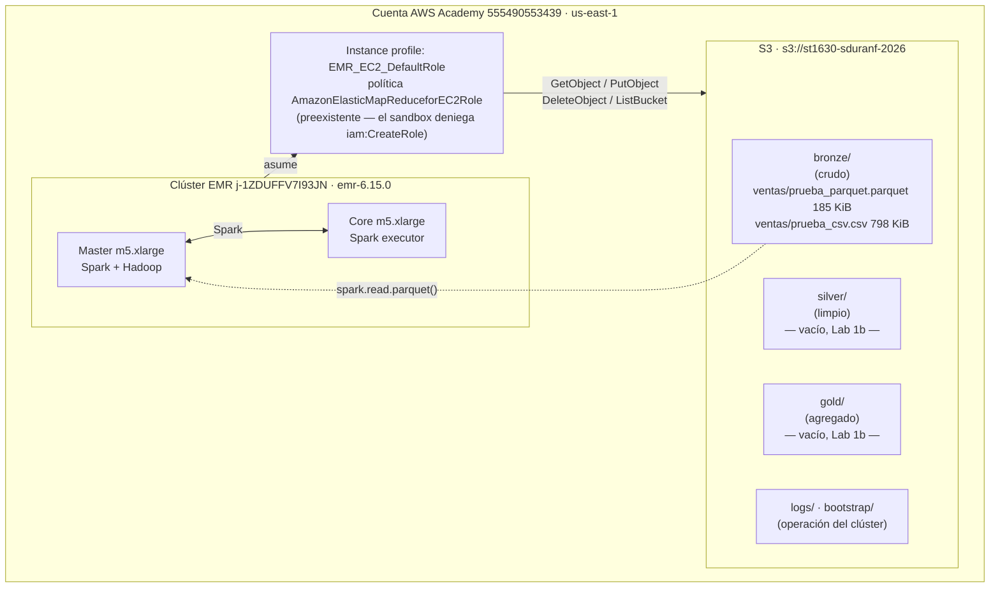

# Arquitectura — Lab 1a

**Curso:** ST1630-2026-2 · **Semana:** S4-S5 · **Fecha de entrega:** 2026-08-13
**Estudiante:** _(tu nombre completo)_ — sduranf@eafit.edu.co

## 1. Diagrama de la arquitectura



## 2. Decisiones de S3

| Decisión | Tu elección | Justificación |
|---|---|---|
| Nombre del bucket | `st1630-sduranf-2026` | Sigue la convención `st1630-{usuario}-{año}` del lab. Como los nombres de bucket son únicos a nivel global, usar el usuario institucional garantiza que no colisione con el de otra cuenta ni con el de un compañero. |
| Región | `us-east-1` (Norte de Virginia) | Viene impuesta por el entorno: el Sandbox de AWS Academy solo opera en `us-east-1`. Dicho eso, tampoco la habría cambiado teniendo la opción: es la región con mayor disponibilidad de servicios y las tarifas más bajas, y mantener el bucket y el clúster en la misma región evita costos de transferencia entre regiones. |
| Estructura de prefijos | `bronze/`, `silver/`, `gold/` + `bronze/ventas/`; además `logs/` y `bootstrap/` para operación del clúster | Las tres capas medallion separan los datos por grado de procesamiento, no por origen: Bronze conserva el dato crudo tal como llegó, Silver el limpio y Gold el agregado. Los prefijos operativos (`logs/`, `bootstrap/`) se mantienen fuera de las capas de datos para que un listado de una capa no mezcle datos con artefactos del clúster. |

**Justificación del particionamiento** (3-5 líneas): ¿por qué esa
estructura de prefijos y no otra? ¿Consideraste particionar además por
fecha o región dentro de cada capa?

> Sí lo consideré y lo descarté deliberadamente para este volumen. El dataset
> son 10.000 filas en 185 KB: particionar por `fecha` (365 días) o por `region`
> (5 valores) generaría decenas o cientos de archivos de pocos KB cada uno, es
> decir el *small files problem* — Spark paga el costo de abrir y planificar
> cada archivo, y ese overhead supera con creces cualquier ahorro de I/O a esta
> escala. La partición se justifica cuando cada partición alcanza un tamaño
> comparable al bloque de lectura; con un dataset real, la primera candidata
> sería `fecha`, porque las consultas analíticas de ventas se filtran casi
> siempre por rango temporal.

## 3. Decisiones de IAM

> **Restricción del entorno (hecho verificado):** el rol `voclabs` del Sandbox
> de AWS Academy deniega la creación de identidades IAM, por lo que
> `scripts/setup_iam.sh` no se pudo ejecutar:
>
> ```
> iam:CreateRole        → AccessDenied (al ejecutar el script)
> iam:CreatePolicy      → implicitDeny (simulate-principal-policy)
> iam:AttachRolePolicy  → implicitDeny (simulate-principal-policy)
> iam:PutRolePolicy     → implicitDeny (simulate-principal-policy)
> iam:PassRole          → allowed, solo sobre EMR_EC2_DefaultRole,
>                         EMR_DefaultRole y LabRole
> ```
>
> Por indicación del profesor se usó el rol preexistente
> **`EMR_EC2_DefaultRole`**, cuya política gestionada es
> `AmazonElasticMapReduceforEC2Role`. El service role del clúster es
> `EMR_DefaultRole` (`AmazonElasticMapReduceRole`).

- ¿Qué permisos otorgaste al rol de EMR, exactamente?

  No otorgué permisos: heredé los de `AmazonElasticMapReduceforEC2Role`, una
  política gestionada por AWS que concede acceso amplio a S3 —sobre cualquier
  bucket accesible desde la cuenta— además de permisos sobre DynamoDB, EC2 y
  CloudWatch. Lo que el clúster realmente necesitaba para este lab era mucho
  menos: leer los dos objetos de `bronze/ventas/`, escribir en `logs/` y en
  `bootstrap/`, y listar el bucket. Es decir, el rol tiene un alcance de cuenta
  entera para una necesidad de un solo prefijo.

- ¿Qué permisos consideraste y descartaste? ¿Por qué?

  El diseño que habría aplicado es el de `setup_iam.sh`: `s3:GetObject`,
  `s3:PutObject` y `s3:DeleteObject` restringidos a
  `arn:aws:s3:::st1630-sduranf-2026/*`, y `s3:ListBucket` sobre
  `arn:aws:s3:::st1630-sduranf-2026` —separado del anterior porque `ListBucket`
  actúa sobre el bucket como recurso y no sobre los objetos—. Descarté
  explícitamente el patrón `"Action": "s3:*"` con `"Resource": "*"`, que es
  justo lo que la política impuesta se aproxima a conceder. No pude aplicar el
  diseño acotado porque el entorno deniega la creación de políticas, no porque
  lo considerara innecesario.

- ¿Por qué importa el mínimo privilegio específicamente en un sistema
  **distribuido** como este (no solo "es buena práctica")? Conecta con
  el Teorema CAP.

  Por dos razones que se refuerzan. La primera es de radio de daño: en un
  sistema distribuido el permiso no vive en una máquina, vive en cada nodo que
  asume el rol. El riesgo no es que EMR decida hacer algo indebido, sino que
  cualquier compromiso de un solo nodo —una credencial filtrada, un bug en un
  job, una dependencia maliciosa instalada por el bootstrap— hereda
  automáticamente todo ese alcance, y convierte un incidente local en uno de
  toda la cuenta. Con dos nodos son dos puntos de entrada; con doscientos, son
  doscientos.

  La segunda es estructural y es la que conecta con CAP. CAP formaliza que un
  sistema distribuido funciona porque cada nodo cumple un contrato que los demás
  dan por supuesto: cuando un nodo devuelve un dato obsoleto, no falla solo ese
  nodo, falla la garantía de consistencia sobre la que el resto construyó su
  lógica. El exceso de privilegio rompe un contrato del mismo tipo: el resto de
  la cuenta —y de la organización de AWS Academy— opera asumiendo que los
  recursos están aislados entre sí. Un rol que puede alcanzar buckets ajenos
  invalida esa premisa sin que nadie lo note hasta que algo sale mal. En ambos
  casos el sistema no se rompe por un fallo ruidoso, sino porque una pieza dejó
  de cumplir silenciosamente lo que las otras asumían.

## 4. Decisiones de EMR

- Tipo de instancia elegido y justificación:

  **Configuración ejecutada:** clúster `j-1ZDUFFV7I93JN`, release `emr-6.15.0`,
  1 nodo master + 1 nodo core, ambos `m5.xlarge` (4 vCPU / 16 GiB c/u), subnet
  `subnet-004ae8d394125e85e` en la AZ `us-east-1a`, key pair `vockey`.

  Dos nodos es el mínimo real para que Spark corra distribuido: con un solo
  nodo el trabajo se ejecutaría en modo local, en un único proceso, y no
  existiría shuffle entre executors —justamente el comportamiento que el lab
  busca observar en el DAG—. El `Exchange` que aparece en la captura del Spark
  UI solo existe porque hay separación real entre driver y executor. `m5.xlarge`
  es de propósito general y equilibra CPU y memoria, suficiente para 10.000
  filas sin sobredimensionar el gasto de créditos.

  Para producción cambiaría tres cosas: más core nodes dimensionados por el
  volumen real de datos en lugar de por el mínimo viable; instancias **spot**
  dentro de *instance fleets* para los executors, que abaratan drásticamente el
  cómputo tolerante a interrupciones mientras el master se mantiene on-demand;
  y **autoescalado** por carga, para no pagar capacidad ociosa entre cargas de
  trabajo. Además mantendría la separación entre cómputo y almacenamiento que
  ya tiene esta arquitectura —los datos viven en S3, no en HDFS del clúster—,
  que es lo que permite apagar el clúster sin perder nada.

- Configuración de Spark/aplicaciones instaladas:

  Aplicaciones `Spark` y `Hadoop`; bootstrap action que instala `pandas` y
  `pyarrow` en todos los nodos; logs del clúster en
  `s3://st1630-sduranf-2026/logs/`. Para este lab no hizo falta tocar la
  configuración por defecto de Spark, aunque el DAG muestra un punto mejorable:
  `spark.sql.shuffle.partitions` está en 1.000 por defecto y la consulta produce
  6 filas, así que AQE tuvo que colapsar el shuffle a una sola partición.

## 5. Estimación de costo

> Tarifas on-demand de referencia en `us-east-1`: `m5.xlarge` ≈ USD 0,192/hora
> por instancia + recargo de EMR ≈ USD 0,048/hora por instancia = **USD 0,24/h
> por instancia**, × 2 instancias = **USD 0,48/hora** de clúster.
> **Verificar en [calculator.aws](https://calculator.aws/) antes de dar el dato
> por definitivo.**

| Escenario | Costo estimado |
|---|---|
| Clúster encendido 24/7 durante un mes | ≈ **USD 350** (0,48/h × 730 h = 350,40), más el EBS de los nodos (~USD 6-10/mes con los volúmenes por defecto) y el almacenamiento S3 (~1 MB, despreciable). Total ≈ **USD 356-360**, más de siete veces el crédito total del semestre. |
| Clúster encendido solo durante las ~3 horas que lo usaste para el lab | ≈ **USD 1,44** de cómputo (0,48/h × 3 h) más centavos de EBS. El clúster real estuvo activo ~45 minutos: ≈ **USD 0,36**. |

La diferencia entre ambas filas es el argumento entero a favor de separar
cómputo y almacenamiento: el bucket sigue existiendo y costando prácticamente
nada, mientras que el clúster solo cuesta mientras está encendido.

## 6. Reflexión — la era agéntica

¿En qué decisión de este lab dudaste más? ¿Qué le consultaste a un
agente de IA y qué terminaste decidiendo por tu cuenta?

> Dudé en dos momentos, y los dos tienen la misma forma: decidir si aceptaba lo
> que el sistema me daba o lo cuestionaba. El primero fue el bloqueo de IAM.
> Cuando `setup_iam.sh` falló, el agente diagnosticó con `simulate-principal-policy`
> qué estaba permitido y qué no, y planteó alternativas —entre ellas aplicar el
> mínimo privilegio con una bucket policy—, pero la decisión de no inventarme un
> mecanismo por mi cuenta y consultar al profesor fue mía; él indicó usar el rol
> ya creado. El segundo fue el benchmark: que Parquet saliera más lento que CSV
> contradecía lo visto en clase, y la primera reacción fue asumir que algo estaba
> mal hecho. Terminé concluyendo que el resultado era correcto y que lo que
> fallaba era mi expectativa: a 185 KB no hay I/O suficiente para que la ventaja
> columnar aparezca. En los dos casos lo delegable fue el diagnóstico técnico; la
> lectura de qué significaba, no.

## 7. Bitácora de delegación

| Tarea | ¿Delegado a agente? | Justificación |
|---|---|---|
| Instalación de AWS CLI v2 y setup del entorno local | Sí — Claude Code (Opus 5) | Configuración de herramientas, sin valor de aprendizaje del curso. |
| Edición de variables (`ESTUDIANTE`, `KEY_NAME`, `SUBNET_ID`) en los scripts | Sí — Claude Code | El boilerplate ya venía resuelto en el repo; el lab autoriza expresamente delegar estos ajustes. |
| Ejecución de `setup_s3.sh` y `create_emr.sh` | Sí — Claude Code | Ejecución mecánica de scripts provistos, verificada contra la salida esperada del README. |
| Troubleshooting (rutas MSYS en `file://`, choque `--use-default-roles` vs `InstanceProfile`, apertura del puerto 22) | Sí — Claude Code | El lab clasifica el troubleshooting de AWS CLI/EMR como delegable: memorizar mensajes de error de la CLI tiene bajo valor de aprendizaje. |
| Diagnóstico de permisos IAM del sandbox (`simulate-principal-policy`) | Sí — Claude Code | Es diagnóstico técnico, no diseño: sirvió para saber qué permitía el entorno, no para decidir qué permisos eran correctos. |
| Ejecución del notebook en el clúster y conversión de la captura del DAG a PNG | Sí — Claude Code | Operaciones mecánicas sobre evidencia propia; los resultados son de mi ejecución real (`application_1786654608050_0001`). |
| **Redacción** de las justificaciones de este documento y del análisis del notebook | **Sí — Claude Code, redacción asistida** | Las decisiones, posturas y criterios son míos; el agente los convirtió en prosa a partir de mis respuestas. El contenido no es del agente, la redacción sí. |
| Decisión de qué permisos IAM otorgar | No — indicación del profesor | Ante el bloqueo del sandbox, consulté al profesor y él indicó usar el rol preexistente. |
| Diseño de la estructura de prefijos Bronze/Silver/Gold y del particionamiento | No | Decisión de arquitectura evaluada en este documento. |
| Interpretación del benchmark Spark y del DAG | No | Es evidencia empírica de mi propia ejecución; el agente aportó los datos medidos, la lectura es mía. |
